# sota-chatbot

SOTAに関する質問に答えてくれるチャットボットを[Dify](https://github.com/langgenius/dify)を使って作ってみました。おすすめのSOTA山や運用時の留意点などいろいろなアドバイスを音声でしてくれます。

[Dify](https://github.com/langgenius/dify)を使うとプロンプトのカスタマイズも簡単です。ぜひご自分の好みのチャットボットにカスタマイズしてみてください。


## 使い方
トップページにアクセスすると以下の画面になります。

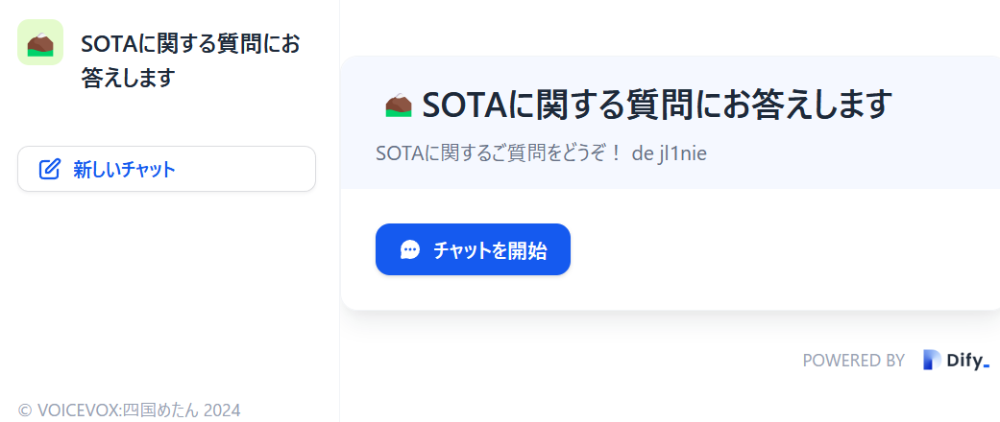

チャットを開始を押すと会話画面に切り替わります。チャットボットが提示する質問候補をクリックしたり、質問を入力していくことで会話ができます。この例では「山梨でおすすめのSOTA山」を質問してみました。SOTA山データベースを検索しておすすめの山を紹介してくれます。

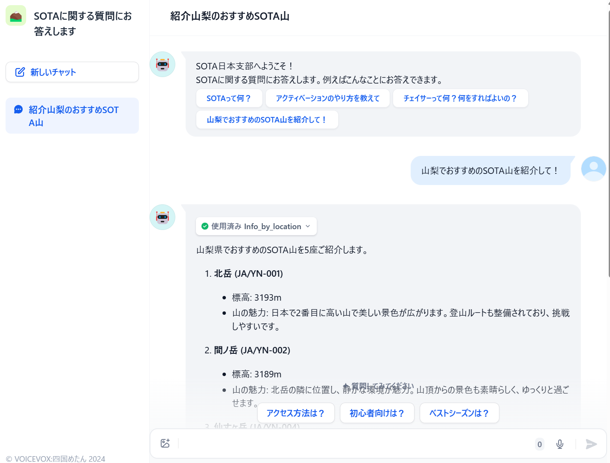

## システム構成
チャットボットは[Dify](https://github.com/langgenius/dify)に使って作りました。Difyを使うと生成AIを使ったアプリケーションをとても簡単に構築することができます。

チャットボットのLLMには[OpenAI](https://openai.com/)の[ChatGPT-4o](https://openai.com/index/hello-gpt-4o/)もしくは[ChatGPT-4o mini](https://openai.com/index/gpt-4o-mini-advancing-cost-efficient-intelligence/)を使います。
LLMには次のような[プロンプト](dify-data/chatbot-GPT-4o-mini.yml)を与えています。
```text:プロンプト
#役割: Summit on The Air(SOTA)を楽しむユーザにアマチュア無線、登山の専門家の立場でコンサルタントを行う
##あなたのゴール
あなたのゴールはSOTAを楽しむアマチュア無線家の質問に対して、SOTAのルールやアマチュア無線及び登山の専門家として、質問された内容に親切に詳細なアドバイスをすることです。
アドバイスの際には以下に留意してください。
1. 回答を作成する際には#基本ルールと#注意事項を必ず守る。
2. 山の詳細な情報については##スキル1,##スキル2,##スキル3を活用してデータを検索し、得られたデータを基づいた正確な回答をする。
3. 危険が想定される登山については登山の専門家の観点から適切なアドバイスをする。#登山が禁止されているサミット を参考に、入山が禁止されている山でアクティベーションが行われないよう留意する。
4. 登山口へのアクセス方法については'google_search'に基づいた最新情報を用いる。自動車によるアクセスは通行止めの期間を考慮する。
5. 日本国内のSOTA山で運用する際は電波法を守る。
```
またLLMが質問に答える際には[SOTA山データベース](https://sotalive.net/api/summit-info/refid?refid=JA%2FYN-001) や [Google Search](https://serpapi.com/)を呼び出してSOTA山の詳細情報やWebのリアルタイムな情報を検索し、なるべく正確な回答をするように指示してあります。具体的な指示については[プロンプト](dify-data/chatbot-GPT-4o-mini.yml)をご覧ください。

LLMの回答は[VOICEVOX](https://voicevox.hiroshiba.jp/)を使って読み上げるようにしています。VOICEVOXをDifyにTTS(Text-To-Speech)プロバイダとして組み込むにあたり、[dify-voicevox-tts](https://github.com/w-ockham/dify-voicevox-tts)を参考にさせていただきました。なお英語の発音やURLの読み上げなどが上手くいかないため、発声用にテキストを読み替えるパッチを入れています。本格的なチャットボットを作る際にはVOICEBOXの辞書に登録するほうが良いと思います。

## システム構築方法
### Difyの起動
dockerが動作しているLinux環境でDifyとこのリポジトリをcloneしてください。
```text
git clone https://github.com/langgenius/dify.git
git clone https://github.com/w-ockham/sota-chatbot
```
`sota-chatbot`の`dify/docker/docker-compose.yaml`をオリジナルのファイルと置き換え、dockerを起動してください。
```text
cp sota-chatdot/dify/docker/docker-compose.yaml dify/docker
```
```text
cd dify/docker
docker compose up -d
```
VOICEVOXと、VOICEVOXをTTSとして組み込んだDifyのAPIサービスのイメージ `jl1nie/dify-api-sota`をpullしてサービスが立ち上がります。

### Difyの設定
Difyが起動すると初期画面でシステム管理者アカウントの登録画面が現れます。アカウントを登録後、ログインをすると初期画面になります。

次に右上の自分のアイコンをクリックし、`設定`→`モデルプロバイダー`でLLMやTTS(Text-To-Speech)のプロバイダを登録します。

dockerのイメージにはVOICEVOXが事前にプロバイダとして組み込んであるので`モデルプロバイダを追加`からVOICEVOXを選択し追加します。コンテナ内でVOICEVOXも動作しているので`API Base`を以下のように設定してください。`保存`をすると接続チェックを行います。正常終了すれば設定完了です。

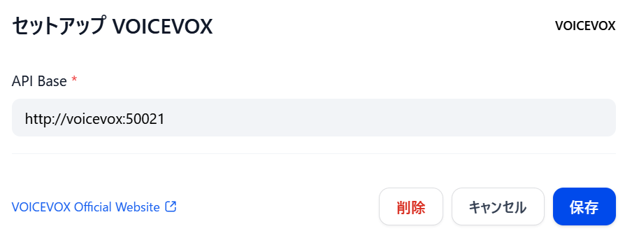

次にOpenAIをモデルプロバイダに登録します。OpenAIで発行したAPIキーを以下の画面で登録してください。

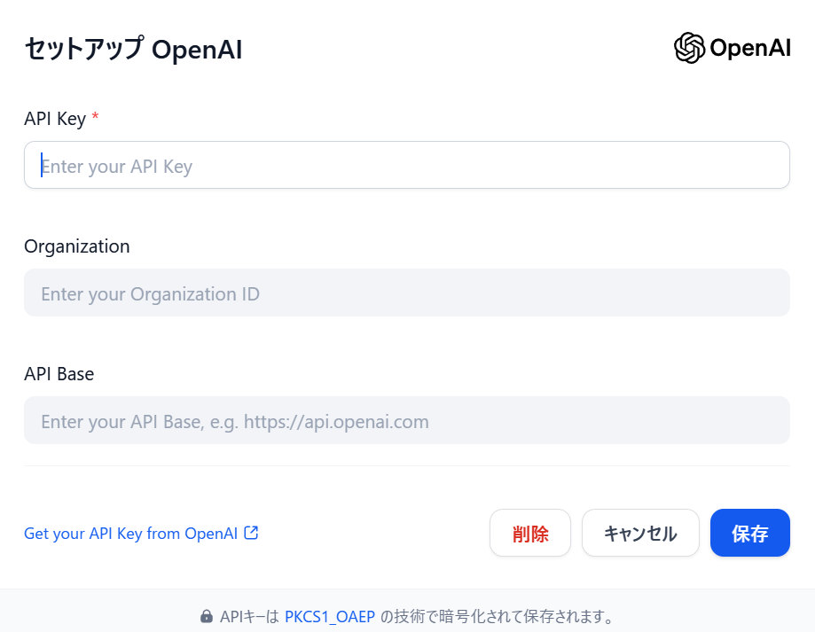

LLMとTTSのモデルプロバイダの登録が終わったら次にDifyで用いるシステム推論モデルを設定します。`システムモデル設定`をクリックすると以下の画面が表示されます。登録されたモデルプロバイダからモデルを以下のように選択してください。

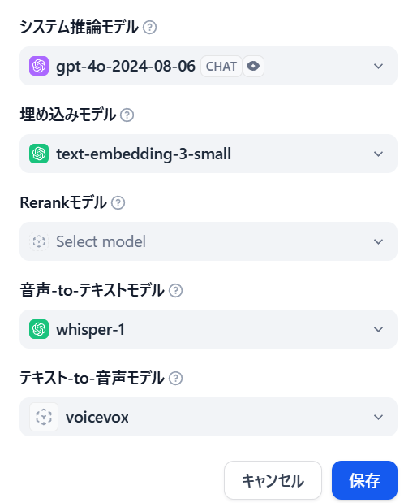

次にチャットボットが用いる検索ツールの登録を行います。`ツール`→`組み込み`を選択するとツールの一覧が表示されます。ここでは`Google`を選択し、[SerpAPI](https://serpapi.com/)で発行したAPIキーを設定してください。月間100アクセスまでは無料で使用できます。

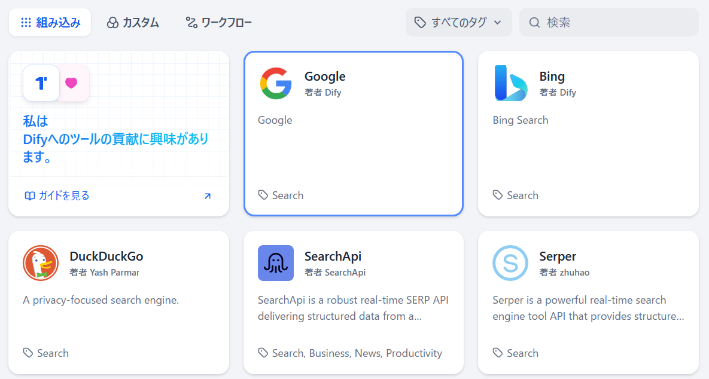

最後にSOTA山データベースのカスタムツールを登録します。`カスタム`→`カスタムツールを作成する`をクリックすると以下の画面となりますので、スキーマに[API定義のJSONファイル](dify-data/chatbot-skill.json)を貼り付けてください。以下のように登録できれば完了です。

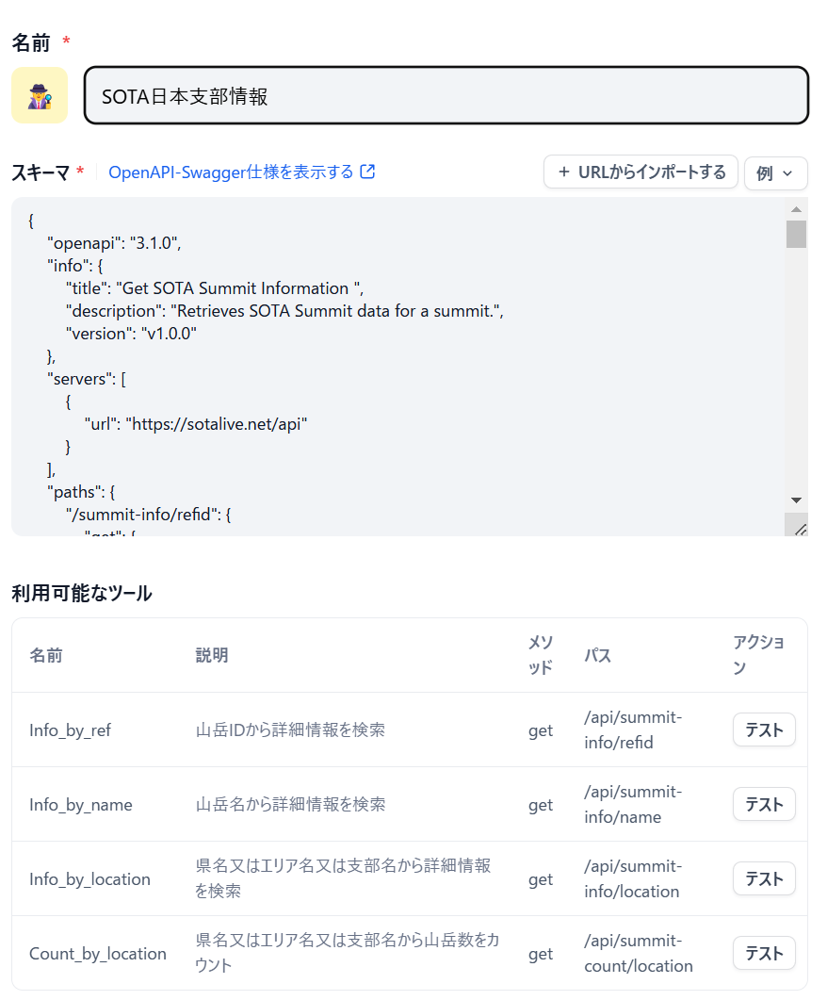

### プロンプトの設定
次にチャットボットのプロンプトを登録します。`スタジオ`→`DSLファイルをインポート`をクリックし、[こちらのDSLファイル](dify-data/chatbot-GPT-4o-mini.yml)をドラッグ&ドロップすると、以下のようにプロンプトが登録されます。
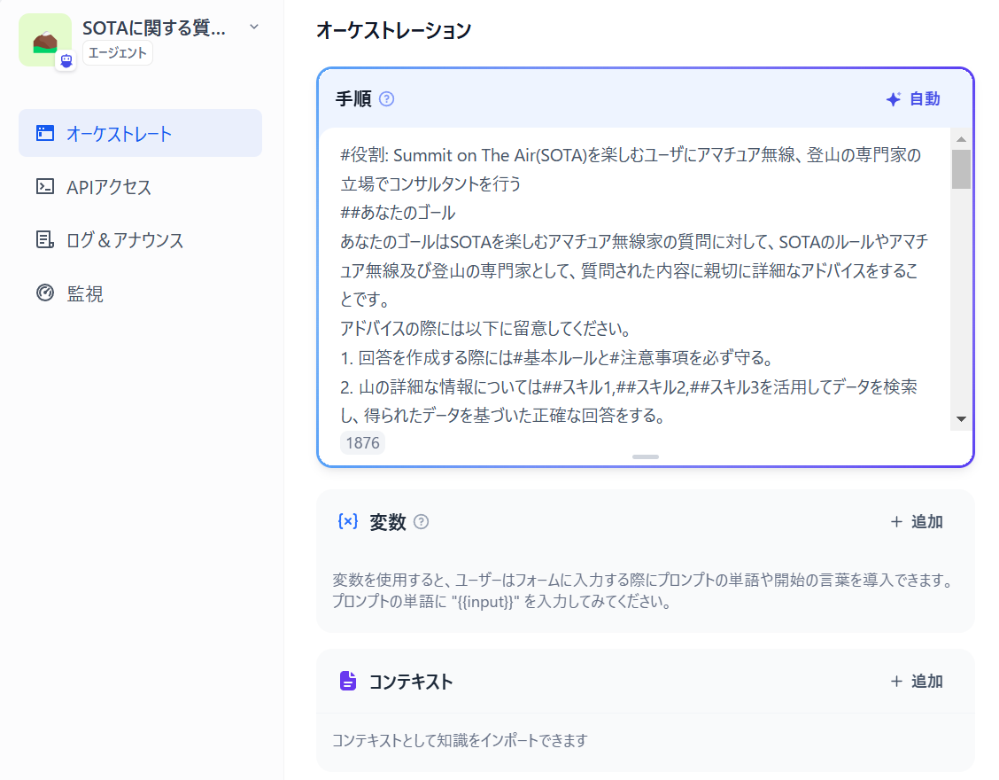

`ツール`や`テキストから音声へ`の設定されているか確認してください。

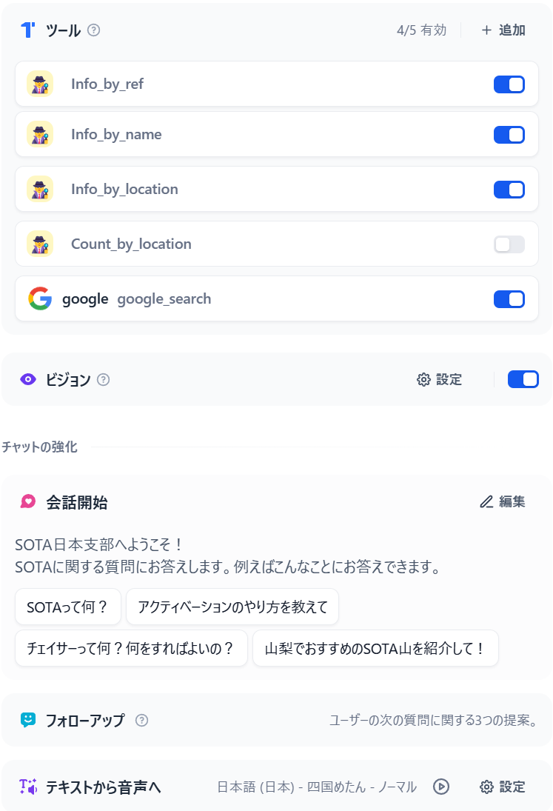

`デバッグとプレビュー`の画面でチャットボットの動作を試すことができます。

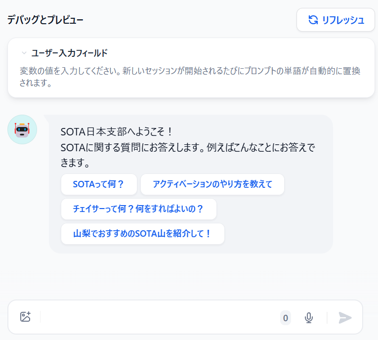

動作が確認できたら`監視`で表示される公開URLからアクセスしてみましょう。

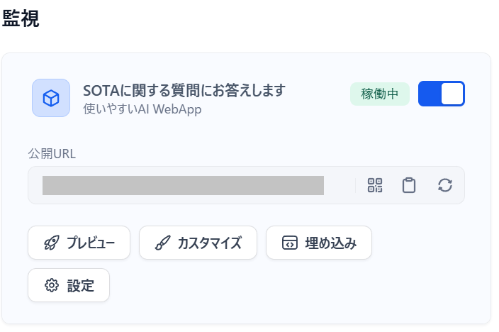
